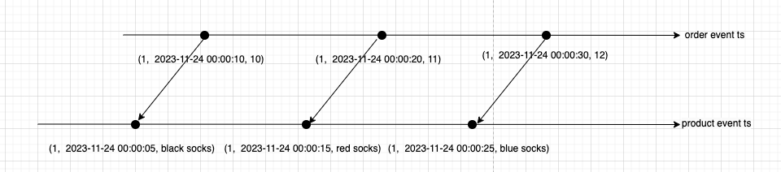
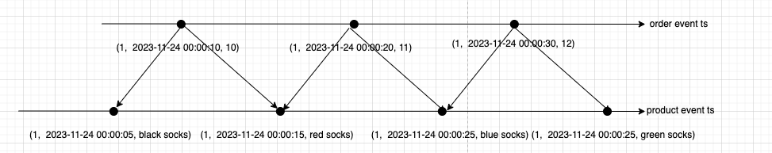

# Temporal Join VS Interval Join in Streaming Job

In streaming jobs, the join operation is a very common operation. Flink provides a variety of join types, Go to [Joins](https://nightlies.apache.org/flink/flink-docs-release-1.20/docs/dev/table/sql/queries/joins/) for more details.

For this section, we will focus on the following join types:

1. Temporal Join based on Event Time
2. Interval Join based on Event Time

## Temporal Join based on Event Time

The Temporal Join based on Event Time allow two streaming events joined based on their event timestamps and keys.

Let's use Flink Sql to create two streams to implement a simple temporal join based on event time.

```sql
CREATE TABLE orders (
    order_id             INT,
    order_ts             TIMESTAMP(3),
    order_amount         DOUBLE,
    product_id           INT,
    WATERMARK FOR order_ts AS order_ts
) <@template.table_socket_source hostname = 'host.docker.internal' format = 'json' port = '9990'/>

CREATE TABLE products (
    product_id          INT,
    product_name        STRING,
    product_ts          TIMESTAMP(3),
    WATERMARK FOR product_ts AS product_ts
) <@template.table_socket_source hostname = 'host.docker.internal' format = 'json' port = '9991'/>

-- convert product stream to dimension table
CREATE VIEW dimemsion_products AS
SELECT * FROM (
    SELECT *, ROW_NUMBER() OVER w AS row_nu
    FROM products
    WINDOW w AS (PARTITION BY product_id ORDER BY product_ts DESC)
) WHERE row_nu = 1;

CREATE VIEW order_join_product AS
SELECT o.order_id, o.order_ts, o.order_amount, p.product_name
FROM orders AS o
INNER JOIN dimemsion_products FOR SYSTEM_TIME AS OF o.order_ts AS p
    ON o.product_id = p.product_id;
    
PRINT FROM order_join_product; 
```

The above sql will create two streams, one is orders stream, another is products stream. The orders stream and products stream is temporal-joined based on the product_id and event time.

Goto [Develop first simple streaming sql job based on local docker](../your_first_simple_job.md) to learn how to run the above SQL with docker.

Let's import some test data to the orders stream and products stream.

```shell
$ nc -l 9990
{"order_id":1, "order_ts":"2023-11-24 00:00:10", "order_amount":10, "product_id":1}
{"order_id":2, "order_ts":"2023-11-24 00:00:20", "order_amount":11, "product_id":1}
{"order_id":3, "order_ts":"2023-11-24 00:00:30", "order_amount":12, "product_id":1}
{"order_id":4, "order_ts":"2023-11-24 00:00:40", "order_amount":10, "product_id":2}

```

```shell
$ nc -l 9991
{"product_id":1, "product_name":"black socks", "product_ts":"2023-11-24 00:00:05"}
{"product_id":1, "product_name":"red socks", "product_ts":"2023-11-24 00:00:15"}
{"product_id":1, "product_name":"blue socks", "product_ts":"2023-11-24 00:00:25"}
{"product_id":1, "product_name":"green socks", "product_ts":"2023-11-24 00:00:35"}

```

```shell
3> +I[1, 2023-11-24T00:00:10, 10.0, black socks]
3> +I[2, 2023-11-24T00:00:20, 11.0, red socks]
3> +I[3, 2023-11-24T00:00:30, 12.0, blue socks]
```

The following image show how these two streams are temporal-joined.



Each order event will be joined with the latest product event based on the product_id and event time.

## Interval Join based on Event Time

The Interval Join based on Event Time allow two streaming events joined based on a range of their event timestamps and keys.

Let's use Flink Sql to create two streams to implement a simple Interval join based on event time.

```sql
CREATE TABLE orders (
    order_id             INT,
    order_ts             TIMESTAMP(3),
    order_amount         DOUBLE,
    product_id           INT,
    WATERMARK FOR order_ts AS order_ts
) <@template.table_socket_source hostname = 'host.docker.internal' format = 'json' port = '9990'/>

CREATE TABLE products (
    product_id          INT,
    product_name        STRING,
    product_ts          TIMESTAMP(3),
    WATERMARK FOR product_ts AS product_ts
) <@template.table_socket_source hostname = 'host.docker.internal' format = 'json' port = '9991'/>

CREATE VIEW order_join_product AS 
SELECT o.order_id, o.order_ts, o.order_amount, p.product_name
FROM orders AS o
INNER JOIN products AS p
    ON o.product_id = p.product_id AND o.order_ts BETWEEN p.product_ts - INTERVAL '5' SECOND AND p.product_ts + INTERVAL '5' SECOND;

PRINT FROM order_join_product;
```

Let's import same test data to the orders stream and products stream.

```shell
$ nc -l 9990
{"order_id":1, "order_ts":"2023-11-24 00:00:10", "order_amount":10, "product_id":1}
{"order_id":2, "order_ts":"2023-11-24 00:00:20", "order_amount":11, "product_id":1}
{"order_id":3, "order_ts":"2023-11-24 00:00:30", "order_amount":12, "product_id":1}
{"order_id":4, "order_ts":"2023-11-24 00:00:40", "order_amount":10, "product_id":2}

```

```shell
$ nc -l 9991
{"product_id":1, "product_name":"black socks", "product_ts":"2023-11-24 00:00:05"}
{"product_id":1, "product_name":"red socks", "product_ts":"2023-11-24 00:00:15"}
{"product_id":1, "product_name":"blue socks", "product_ts":"2023-11-24 00:00:25"}
{"product_id":1, "product_name":"green socks", "product_ts":"2023-11-24 00:00:35"}

```

```shell
3> +I[1, 2023-11-24T00:00:10, 10.0, black socks]
3> +I[1, 2023-11-24T00:00:10, 10.0, red socks]
3> +I[2, 2023-11-24T00:00:20, 11.0, red socks]
3> +I[2, 2023-11-24T00:00:20, 11.0, blue socks]
3> +I[3, 2023-11-24T00:00:30, 12.0, blue socks]
3> +I[3, 2023-11-24T00:00:30, 12.0, green socks]
```

The following image show how these two streams are interval-joined.



Each order event will join 2 product events that the product event timestamp is between the order event timestamp - 5 seconds and the order event timestamp + 5 seconds.
